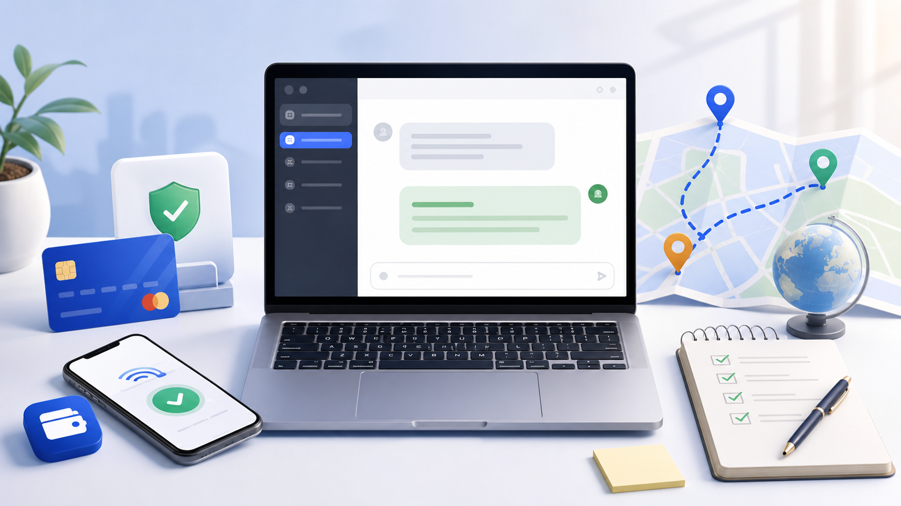

# <p align="center">[亲测整理] 2026 年国内开通 ChatGPT Plus 的几种方法教程</p>

<p align="center">本教程最新更新时间：2026 年 6 月 22 日</p>



ChatGPT Plus 对高频用户来说确实很有吸引力：写作、代码、文件分析、图片理解和资料整理都会顺手不少。

但国内用户真正卡住的地方，往往不是不会用 ChatGPT，而是支付和账号稳定性：信用卡被拒、支付页打不开、验证失败、网络节点不稳定、第三方服务不知道怎么选。

我把自己会考虑的方式先列成四类，后面再逐个展开：

| 方法 | 适合人群 | 我的看法 |
|---|---|---|
| 海外信用卡 / 虚拟卡 | 熟悉海外支付、愿意自己排查的人 | 自主性高，但门槛和失败成本也高 |
| iOS 内购 | 主要用 iPhone / iPad 的用户 | 适合已有稳定 Apple ID 环境的人 |
| 第三方自助充值平台 | 不想折腾支付、希望支付宝 / 微信解决的人 | 省事，但要重点看是否不收密码 |
| 共享账号 | 只想短期低价体验的人 | 不建议长期使用，隐私和稳定性都弱 |

如果你已经是 Plus 用户，真正的问题变成了“额度不够、要不要上 Pro”，可以先看后面的判断标准。不要因为看到更高档位就直接升级，先确认自己是不是每天都有高强度任务。

------

## 资料库目录

这份仓库会持续收集 ChatGPT Plus 订阅、支付异常、账号状态和使用场景相关资料。

| 分类 | 内容 |
|---|---|
| 完整教程 | 当前 README，适合从头了解几种常见开通方式 |
| 公开文章 | [ChatGPT Plus 订阅页面支付异常排查](./articles/chatgpt-plus-payment-troubleshooting.md) |
| 排障清单 | [troubleshooting/](./troubleshooting/) |
| 常见问题 | [faq/](./faq/) |

------

## 目录

- [先说结论](#先说结论)
- [方法一：海外信用卡 / 虚拟卡](#方法一海外信用卡--虚拟卡)
- [方法二：iOS 内购](#方法二ios-内购)
- [方法三：第三方自助充值平台](#方法三第三方自助充值平台)
- [方法四：共享账号](#方法四共享账号)
- [第三方平台自检清单](#第三方平台自检清单)
- [常见问题](#常见问题)
- [常见报错排查](#常见报错排查)
- [Plus 用满后要不要看 Pro](#plus-用满后要不要看-pro)
- [维护说明](#维护说明)
- [更新记录](#更新记录)
- [免责声明](#免责声明)

------

## 先说结论

如果你已经有稳定的海外支付环境，自己订阅当然更顺手。

如果你只是卡在支付环节，又不想把账号密码交给别人，我会优先看不收密码、流程透明、售后规则写清楚的第三方自助充值平台。

共享账号我只建议当作短期体验，不建议放工作资料、代码、文档或任何隐私内容进去。

------

## 方法一：海外信用卡 / 虚拟卡

- **适合谁：** 熟悉海外支付、能自己排查网络和账单问题的人。
- **基本思路：** 准备可用于海外线上支付的 Visa / Mastercard，再进入 ChatGPT 的升级页面完成订阅。

大致流程是这样：

1. 准备一张可以用于海外线上付款的卡。
2. 确认网络能稳定打开 ChatGPT 和支付页面。
3. 在 ChatGPT 中选择升级 Plus。
4. 填写卡信息和账单信息。
5. 支付成功后重新登录或刷新页面确认 Plus 状态。

**优点：**

- 账号和支付方式都掌握在自己手里。
- 后续续费、取消订阅、账单查询更直接。
- 如果你本来就有海外订阅需求，一张卡可以覆盖更多服务。

**缺点 / 注意事项：**

- 国内发行的信用卡经常会被拒。
- 虚拟卡平台的开卡、充值、手续费和身份验证流程都要自己处理。
- 一旦失败，很难马上判断是卡、网络、账单地址还是账号状态的问题。
- 短时间内反复尝试付款，可能让账号状态更紧张。

我的看法：这条路更适合本来就会折腾海外支付的人。普通用户只为了开 ChatGPT Plus 从零开始搭这一套，成本不一定划算。

------

## 方法二：iOS 内购

- **适合谁：** 平时主要用 iPhone / iPad，且 Apple ID 环境比较稳定的人。
- **基本思路：** 通过 ChatGPT iOS App 里的订阅入口开通 Plus，再在 Apple 的订阅管理里查看和取消。

大致流程是这样：

1. 在 iPhone 或 iPad 上安装 ChatGPT App。
2. 登录你自己的 ChatGPT 账号。
3. 进入升级入口，查看 Plus 订阅选项。
4. 按 Apple 的付款流程完成订阅。
5. 回到 ChatGPT 确认 Plus 状态。

**优点：**

- 对 iPhone / iPad 用户来说路径比较熟悉。
- 订阅管理集中在 Apple ID 里，后续取消和查看账单比较清楚。
- 不需要在网页端反复处理支付页加载问题。

**缺点 / 注意事项：**

- Apple ID 地区、余额和现有订阅可能互相影响。
- 不适合为了一个 ChatGPT Plus 去随意调整主力 Apple ID。
- 如果你主要在网页、安卓或桌面端使用，未必是最顺手的路径。

我的看法：如果你本来就有稳定的 iOS 订阅环境，可以考虑；如果没有，不建议为了它额外折腾一整套 Apple ID 流程。

------

## 方法三：第三方自助充值平台

- **适合谁：** 不想折腾海外支付，希望用支付宝 / 微信完成开通的人。
- **基本思路：** 你保留自己的 ChatGPT 账号，按平台提示提交必要信息，由平台协助完成 Plus 开通。

我会先看这几条：

1. 不要求提供 ChatGPT 账号密码。
2. Plus 是开到自己的个人账号上，不是共享号。
3. 支付、提交、查询进度和售后规则都写清楚。
4. 失败时怎么处理、多久处理，有没有明确说明。
5. 页面没有诱导你做明显高风险的操作。

我目前会把 [PlusGO](https://plusgo.pro) 放在这个类型里作为一个备选。它更适合已经有自己 ChatGPT 账号、但卡在支付环节的人；我比较在意的是它不需要提交账号密码，支持支付宝 / 微信，并且下单后能按订单状态跟进。

大致流程是这样：

1. 先确认自己的 ChatGPT 账号可以正常登录。
2. 打开平台页面，选择 Plus 或其他适合自己的套餐。
3. 使用支付宝或微信付款。
4. 按页面提示提交一次性临时凭证或必要信息。
5. 等待开通结果，刷新 ChatGPT 页面确认状态。
6. 保存订单号；长时间没变化时，凭订单号联系售后。

**优点：**

- 对普通用户来说省去了大部分支付排查。
- 不需要准备海外信用卡。
- 适合只是想把 Plus 开起来、后面自己正常使用的人。

**缺点 / 注意事项：**

- 仍然是第三方服务，要自己判断平台是否可信。
- 不适合对第三方完全不放心的人。
- 不要把账号密码、邮箱验证码等敏感信息交出去。

我的看法：这条路解决的是「支付和开通」这一段，不等于解决所有账号风险。账号长期稳定，仍然要看你的网络环境和日常使用习惯。

------

## 方法四：共享账号

- **适合谁：** 只想短时间体验一下 Plus 区别，而且完全不放隐私内容的人。
- **基本思路：** 多个人共用同一个 Plus 账号。

我不太推荐共享账号，主要原因是：

- 聊天记录和使用内容可能被别人看到。
- 多人同时使用时，额度、速度和稳定性都不可控。
- 账号归属不在你手里，随时可能失效或改密码。
- 不适合处理工作资料、客户信息、代码、文档和任何私人内容。

如果只是想看一眼 Plus 和免费版有什么差别，短期体验可以理解；但只要你打算认真使用 ChatGPT，还是尽量用自己的账号。

------

## 第三方平台自检清单

如果你最后选择第三方自助充值，我建议下单前至少过一遍这个清单：

```
[ ] 页面说明里没有要求提交 ChatGPT 账号密码
[ ] 能看清楚套餐周期、价格、到账说明和失败处理方式
[ ] 支付后有订单号或可查询的订单状态
[ ] 售后入口明确，不是只能靠临时私聊
[ ] 没有承诺夸张效果，也没有诱导你做高风险操作
[ ] 自己的 ChatGPT 账号可以正常登录和使用
[ ] 重要聊天记录、工作资料和隐私信息已经做好风险判断
```

我个人会把「不交密码」放在第一位。价格便宜一点并不值得拿主账号去赌，尤其是账号里有长期对话、工作资料或自己调好的 GPTs 时。

------

## 常见问题

### Q1：国内信用卡为什么经常失败？

一般是支付风控、发卡地区、账单信息和网络环境共同影响。即使卡面是 Visa 或 Mastercard，也不代表一定能通过 ChatGPT 的订阅付款。

如果已经连续失败几次，我不建议继续硬试。先停下来确认账号能否正常登录、网络是否稳定、支付页面是否完整加载，再决定要不要换方案。

### Q2：第三方自助充值会不会要求给密码？

我会把「是否要求账号密码」当作筛选红线。正常自助流程不应该让你把 ChatGPT 密码、邮箱验证码之类的信息交出去。

如果对方要求完整账号密码，我会直接放弃。

### Q3：一次性临时凭证和账号密码一样吗？

不是一回事，但它依然属于敏感信息。只在你确认网址、流程和订单都没问题时提交，提交后保留订单号，遇到异常就走售后。

### Q4：充值成功后没有看到 Plus 怎么办？

先做三件事：

1. 退出 ChatGPT 后重新登录。
2. 换浏览器无痕模式或清理缓存再看。
3. 确认提交的是不是你当前正在使用的账号。

如果还是没有变化，不要反复重新下单，拿订单号联系平台售后。

### Q5：到期后会自动续费吗？

看你选择的方式。自己订阅或 iOS 内购通常有订阅管理入口；第三方自助充值一般更接近单次购买，到期前需要自己再操作一次。

下单前先看清楚页面说明，尤其是套餐周期、到期时间和退款规则。

### Q6：Plus 和 Pro 怎么选？

大多数普通用户先从 Plus 开始就够了。Pro 更适合高频重度使用、对额度和高级能力有明确需求的人。

如果你还不确定自己每天会不会高频使用，不建议一上来就买更贵的套餐。

### Q7：开通之后还需要注意网络环境吗？

需要。开通只是解决订阅状态，日常使用仍然要保持稳定网络，尽量不要频繁切换地区，也不要使用来路不明的公共节点。

### Q8：新账号可以马上升级吗？

能否升级取决于账号状态、网络环境和支付方式。新账号建议先正常登录和使用一段时间，确认邮箱、登录状态和基础功能都稳定后，再考虑升级。

------

## 常见报错排查

### 1. 信用卡被拒

如果使用国内发行的信用卡，失败并不罕见。可以先确认卡是否支持海外线上付款、支付页面是否完整加载、账单信息是否一致。

连续失败时不要反复提交，换方案通常比继续试更省时间。

### 2. 支付页面一直转圈

常见原因是网络节点不稳定、浏览器缓存异常，或者支付页面资源没有完整加载。

可以尝试：

1. 换一个稳定节点。
2. 使用无痕窗口。
3. 清理浏览器缓存。
4. 隔一段时间再试。

### 3. 账号已经付款但状态没刷新

先重新登录账号，再确认是否登录错邮箱。如果是通过第三方平台处理，优先拿订单号联系售后，不要自己连续重复下单。

### 4. 订阅到期后无法续上

先确认当前账号状态是否正常，再看原来的开通方式。iOS 内购去 Apple 订阅管理里看；第三方自助充值则回到原平台查看续费说明。

### 5. 共享账号突然不能用

共享账号本来就不可控。遇到密码变更、额度用完、多人同时登录、账号失效，基本都只能找卖家处理。重要资料不要放在这类账号里。

### 6. 提示所在地区暂不支持

这通常和当前网络出口、账号状态或支付页面判断有关。先确认 ChatGPT 本身能否正常使用，再检查是否频繁切换地区。

如果只是打开聊天没问题，但一到升级或付款页面就失败，说明问题可能集中在订阅流程，不一定是账号本身坏了。

### 7. 提示稍后再试

这种提示很泛，可能是页面临时异常，也可能是短时间内尝试太多。我的处理方式是先停一段时间，不要连续提交付款。

可以换浏览器无痕窗口、确认网络稳定后再看。如果还是失败，就把它当作方案切换信号，不要把同一个账号反复试到更紧张。

### 8. 二次验证失败

有些付款方式会进入额外验证流程。如果验证码收不到、验证页打不开或验证后仍失败，通常不是刷新几次就能解决。

这时先确认卡片是否支持对应的海外线上验证，再决定是否继续走自己付款这条路。

### 9. App 端和网页端状态不一致

有时网页端已经显示 Plus，App 端还没刷新；也可能是 App 登录了另一个邮箱。

先退出 App 重新登录，再检查当前邮箱。如果仍然不同步，可以等一段时间再看，不要马上重复购买。

### 10. 订单显示处理中时间较久

如果通过第三方自助充值平台处理，先看订单页有没有预计处理时间。超过页面说明的时间后，用订单号联系售后。

不建议在一个订单还没结束时连续下多个订单。这样不但不好排查，也可能让你自己搞不清到底是哪一次操作对应哪个账号。

------

## Plus 用满后要不要看 Pro

我会先把 Plus 当作起点，而不是把 Pro 当作默认选择。Plus 适合大多数日常写作、翻译、问答、轻度代码和资料整理；Pro 更适合每天长时间使用 ChatGPT 或 Codex，且经常被额度、任务长度或高强度推理打断的人。

可以按这几个问题判断：

```
[ ] Plus 额度经常在工作中途用完
[ ] 每天会连续用 ChatGPT 或 Codex 处理项目
[ ] 经常做长文档分析、复杂代码修改或深度研究
[ ] 订阅成本能被节省下来的时间覆盖
[ ] 你已经确认不是网络、提示词或使用方式导致的低效
```

如果只是偶尔问答、写文案、翻译和轻度编程，Plus 通常已经够用。等你明确感觉 Plus 限制在影响工作，再考虑 Pro 会更稳。

如果你已经确认自己属于重度用户，可以继续看这份 Pro 教程：[ChatGPT Pro 充值代充指南：国内如何使用微信支付或支付宝订阅 Pro 会员](https://github.com/duck-gogo/chatgpt-pro-tutorial)。

------

## 维护说明

这份教程会优先更新三类内容：

1. ChatGPT Plus 订阅入口或页面提示发生明显变化。
2. 国内用户常见的支付失败、账号状态、续费问题出现新的表现。
3. 第三方自助充值平台的筛选标准需要补充。
4. Plus / Pro 等订阅档位出现新的常见选择问题。

如果你发现某个步骤已经失效，建议先按当前页面提示操作，再结合本文的筛选原则判断是否需要换方案。

------

## 更新记录

- 2026-06-22：补全 `troubleshooting/` 排障清单（付款失败、账号状态、网络地区、第三方订单 4 个主题页）和 `faq/` 常见问题单页，并与本文交叉链接。
- 2026-06-07：更新维护日期，补充 Plus 用满后的 Pro 判断标准，并关联 ChatGPT Pro 教程仓库。
- 2026-05-23：补充完整教程框架、四种开通方式、FAQ 和 10 个常见排错项。

后续如果 ChatGPT 订阅入口、常见失败原因或国内可用方案有变化，我会继续更新这份 README。

------

## 免责声明

本文只整理国内用户开通 ChatGPT Plus 时常见的几种路径和注意事项，不构成任何支付、账号或法律建议。不同平台政策和风控状态会变化，请以实际页面提示为准，并自行判断风险。
