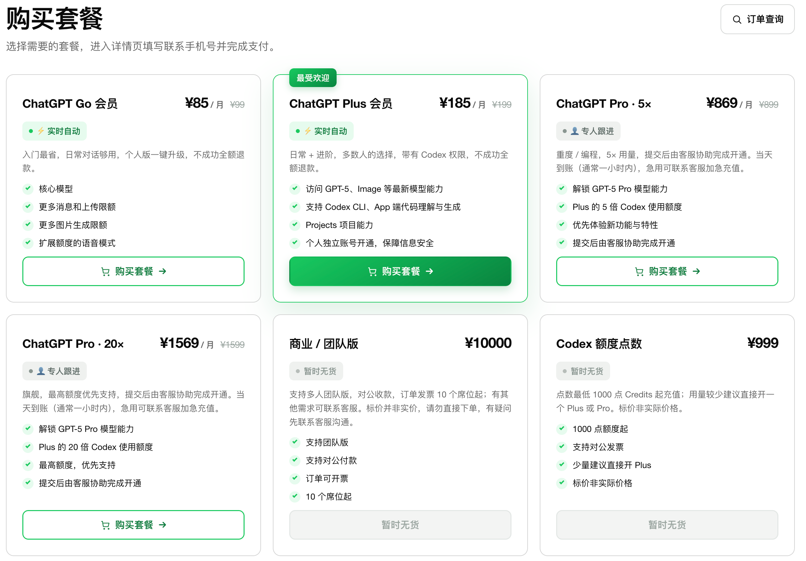
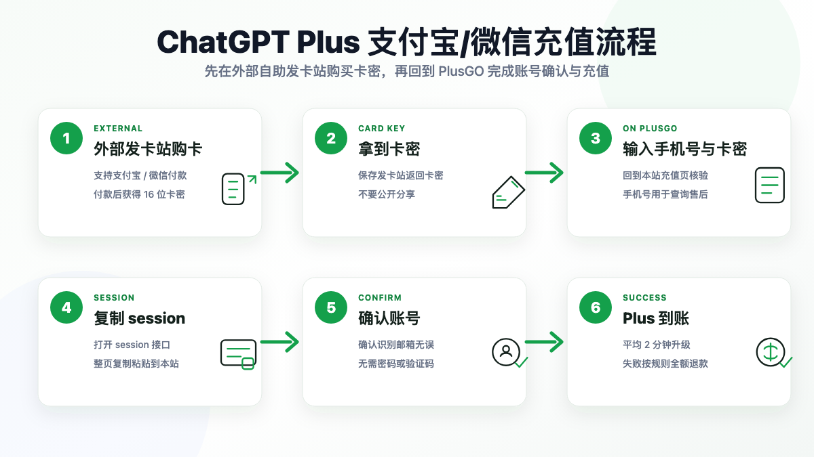
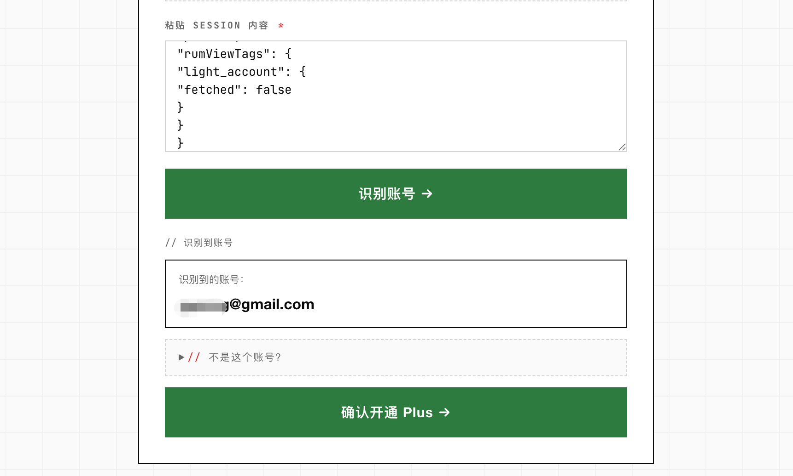
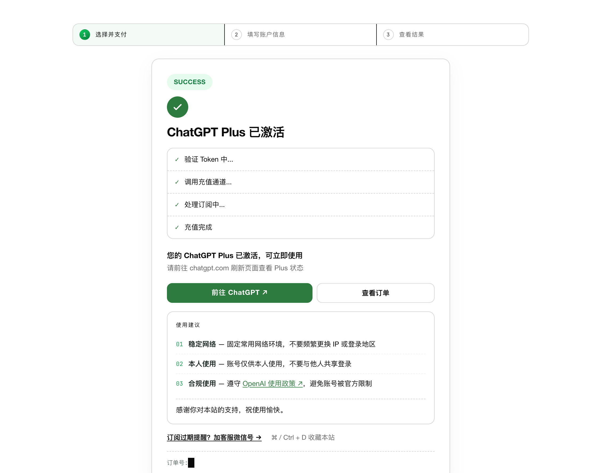

# <p align="center">[亲测可用] 2026 年 ChatGPT 充值 / 代充教程：支付宝、微信开通 ChatGPT Plus、Pro、Go、Codex</p>

<p align="center">本教程最新更新时间：2026 年 6 月 27 日 · 官方渠道，自助充值，不用交账号密码</p>


**建议收藏 + Star 本 ChatGPT 充值教程，方便随时回来查，也防止丢失。**

这两年几种主流路子我全都跑过一遍，踩的坑能写一本书。国内用户真正麻烦的地方，从来不是不会用 ChatGPT，而是卡在 **ChatGPT 充值 / 代充** 这道坎上——国内卡刷不动、支付页疯狂转圈、验证死活过不去、节点一换就被拒、第三方平台又不知道哪个靠谱。这篇就一次性把 2026 年还能走通的几种充值方式掰开揉碎讲清楚，让你少踩坑、少走弯路。

如果你只想快速、稳妥地用支付宝或微信开通 ChatGPT Plus / Pro，可以直接跳到 [方法二：第三方自助代充平台（推荐）](#method-topup)，我自己在用的是 <a href="https://plusgo.pro/?utm_source=github01" target="_blank" rel="noopener">PlusGO（plusgo.pro）</a>。

------

## 国内给 ChatGPT 充值，经常会卡在哪些地方？

- **国内银行卡 / 信用卡无法直接完成 ChatGPT 充值**：即使是 Visa、Mastercard，也常遇到"您的银行卡被拒绝了""付款未获批准"。
- **支付页面打不开、一直转圈**：点了 Upgrade to Plus 之后，Stripe 支付窗口加载半天弹不出来。
- **不清楚 ChatGPT 代充和自己充值有什么区别**：很多人搜"GPT 代充"，其实是想找一种更省心、又不用交账号密码的充值方式。
- **充值后能不能稳定续费、会不会封号**：充值不只是付款成功，还包括 Plus / Pro 权益是否正常到账、后续使用是否稳定。

下面四种方式我都跑过，按"省不省心"从高到低排，并给出一张对比表，直接帮你下结论。

------

## 📚 目录

- [先说结论（一句话）](#summary)
- [方法一：海外信用卡 / 虚拟卡](#method-card)
- [方法二：第三方自助代充平台（推荐）✅](#method-topup)
- [方法三：苹果 App Store 内购](#method-ios)
- [方法四：共享账号 ⚠️](#method-shared)
- [几种 ChatGPT 充值方式对比](#compare)
- [我的大实话（一句话推荐）](#recommend)
- [第三方平台自检清单](#checklist)
- [2026 年 ChatGPT 充值常见问题 FAQ](#faq)
- [附录：国内自己充 ChatGPT 最常见的 10 个报错](#troubleshooting)
- [Plus 用满后要不要看 Pro](#pro)
- [维护说明 / 更新记录](#changelog)

> 更多资料：公开文章 [没有国外信用卡怎么开通 ChatGPT Plus](./articles/chatgpt-plus-without-overseas-card.md) · [订阅页面支付异常排查](./articles/chatgpt-plus-payment-troubleshooting.md) · [排障清单](./troubleshooting/) · [常见问题](./faq/)

------

<a id="summary"></a>

## 先说结论（一句话）

- **有稳定海外支付环境、爱折腾**：可以自己用海外信用卡 / 虚拟卡充，但门槛和失败成本都高。
- **想省心、几分钟用支付宝 / 微信搞定**：选靠谱的第三方自助代充平台，**首选不用交账号密码的**，我在用 PlusGO。
- **只用 iPhone**：苹果内购也能走，但要接受切区和苹果风控。
- **只想短期低价体验、完全不在意隐私**：共享账号能用，但隐私和稳定性都很差，不建议长期用。

------

<a id="method-card"></a>

## 方法一：海外信用卡 / 虚拟卡（适合爱折腾、有海外支付经验的人）

- **适合谁：** 技术上不怵、愿意自己排查网络和账单问题、未来还想订阅 Claude / Netflix / Spotify 等海外服务的人。
- **核心思路：** 准备一张可用于海外线上支付的 Visa / Mastercard，挂干净的美区住宅 IP，在 ChatGPT 官网直接绑卡订阅 Plus。

🚨 **2026 年的现实警告：** 2025 年下半年起，国内主流的几家海外虚拟卡平台因跨境支付合规审查陆续退出运营，过去那套"国内充值 + 一键开卡 + 美区 IP"的傻瓜玩法基本宣告终结。现在还在硬撑的几家，门槛全都拉满了：

- 开卡费 + 月费 + 充值手续费叠加，一年多花不少；
- 大多要过 KYC（身份证 + 人脸），且常常只支持 USDT 充值；
- 平台跑路风险是悬在头上的剑——这两年已经不止一家头部虚拟卡平台先后退场，老用户的余额基本血本无归。

**优点：**

- 最"官方直接"，相当于你自己就是个海外用户，账号完全自主；
- 一卡多用，能覆盖其他需要海外信用卡的服务。

**缺点 / 注意：**

- 网络门槛高——IP 不干净（机房 IP）分分钟在支付页被拒；
- 各种费用叠起来比官方 20 美金贵；
- 一旦失败，很难马上判断是卡、IP、账单地址还是账号状态的问题，反复试还会给账号累加风控分。

**我的大实话：** 这条路只适合本来就爱折腾海外支付的老手。普通人只为开个 ChatGPT Plus 从零搭这一整套，又费钱又费时间，真心不划算。

------

<a id="method-topup"></a>

## 方法二：第三方自助代充平台（目前最省心的方案）✅

- **适合谁：** 怕折腾、不想搞虚拟卡、网络环境一般、想用支付宝 / 微信几分钟搞定的人。
- **核心思路：** 你用人民币（支付宝 / 微信）在国内代充平台下单，平台用企业级海外支付通道 + 干净的美区住宅 IP，帮你在 OpenAI 官方完成 Plus / Pro 订阅。Plus 是开到**你自己的 ChatGPT 账号**上，全程**不用把账号密码交出去**。

⚠️ **选平台先认准三条，少一条都别碰：** 支付通道正规（支付宝 / 微信可追溯）+ 自助充值（不用交账号密码）+ 明确售后承诺（充值失败可退款）。别贪小红书、闲鱼那种极低价的盗刷黑充——十有八九这个月开、下个月就关店，真出了问题你连个人都找不到。一个长期稳定、有真实售后的平台，比省那几块钱重要得多。

我自己跑过好几家，最稳、最省心、价格也最厚道的就是 <a href="https://plusgo.pro/?utm_source=github01" target="_blank" rel="noopener">PlusGO（plusgo.pro）</a>，一句话——**该有的都有，售后靠谱**：支持 ChatGPT Go / Plus / Pro / Codex 充值，支付宝 / 微信付人民币，自助充值不用交密码，平均 2–3 分钟到账，充值失败 100% 原路退款。

**为什么这两年代充最流行：** 操作简单到离谱（基本就是支付宝付一下钱）、几分钟到账、安卓 / iOS / 网页 / Mac 全平台通用，走的是 OpenAI 官方支付通道，正规平台封号风险极低。比起前面折腾虚拟卡、切区那一整套，这玩意儿基本不需要"教程"。

### 套餐和价格都明牌挂着

不像有些平台要先加客服微信再"谈"，正规平台的套餐和价格是公开的。PlusGO 上 Go / Plus / Pro / Codex 几个档位的价格直接挂在页面：



### 整个充值流程（支付宝 / 微信，几分钟搞定）



1. 先确认自己的 ChatGPT 账号能正常登录。
2. 打开 <a href="https://plusgo.pro/?utm_source=github01" target="_blank" rel="noopener">PlusGO</a>，选 Plus 或其他适合自己的套餐。
3. 用支付宝或微信付款。
4. 按提示提交一次性临时会话凭证（access_token，几小时后自动过期），平台自助识别你的账号——**整个过程不需要你的 ChatGPT 密码或邮箱验证码**。

   

5. 等待开通结果，刷新 ChatGPT 页面确认 Plus 状态；保存订单号，长时间没变化时凭订单号联系售后。

   

### 代充这条路的优缺点

**优点：**

- **真方便**——支付宝 / 微信直接付人民币，不用折腾虚拟卡或代理 IP；
- **速度快**——自助平台付完款几分钟到账；
- **风险低**——正规平台用企业级海外通道 + 干净住宅 IP，账号完全自主，封号率极低；
- **全平台通用**——升级后安卓 / iOS / 网页 / 桌面端都能用。

**缺点 / 注意：**

- **依赖第三方**——所以一定要选运营稳定、有真实售后承诺的平台，别图便宜碰小作坊；
- **价格随汇率有微调**——但相比官方 20 美金 + 海外信用卡门槛，整体性价比已经很高；
- **🚨 隐私红线**：靠谱的自助平台**绝不需要你提供 ChatGPT 账号密码**。一切让你交完整账号密码的小代充、个人代充，**绝对别用！**

### PlusGO 的售后条款（白纸黑字，不玩虚的）

代充这条路最怕"付完款人就消失"，所以售后一定要写在明面上。下面是 PlusGO 官网公开挂着的几条，下单前可以直接对照：

- **充值失败 100% 全额退款**——所有失败订单当天原路退回（支付宝 / 微信原路退），通常 2 小时内到账，平台不留任何手续费。
- **两种退款情形都认**：①卡密未消耗、账号已在订阅有效期内、或登录凭证解析失败 → 联系客服原路退款；②确认无法开通（如账号被官方限制）→ 客服核实后原路退款。
- **充值成功后 30 天掉订阅保障**——万一中途掉订阅，客服跟进补开 / 处理，不是付完款就不管。
- **明码标价、无隐藏费用**——不收"开卡费""代付手续费"，购买页和充值页价格一致。
- **真人客服在线**——每天 09:00–23:00 中文真人客服，凭订单号或手机号就能查单、走售后（手机号只用于订单查询和售后联系，不绑定你的 ChatGPT 账号）。

⚠️ 注意：**已经成功开通、账号也能正常用的订单，一般不支持七天无理由退款**——Plus / Pro 属于虚拟数字商品，已交付即视为消费完成，这一条所有正规平台都一样。

------

<a id="method-ios"></a>

## 方法三：苹果 App Store 内购（仅限苹果用户）

- **适合谁：** 有 iPhone / iPad、且 Apple ID 环境比较稳定的人。
- **核心思路：** 把 Apple ID 切到美区，给余额充值后，在 iOS 版 ChatGPT App 内通过苹果内购订阅 Plus。

**步骤大概是：**

1. **切换 Apple ID 到美区**（一次性操作，但有点折腾）：需要美国地址、邮编、电话；**切换前会清空现有订阅和余额，务必想清楚。**
2. **给美区 Apple ID 充值余额**（支付宝有出境充值入口）。
3. **在 iOS 版 ChatGPT App 内订阅**：登录账号 → 升级 Plus → 付款方式选 "Apple ID Balance"。

**优点：**

- 走苹果官方内购，流程在苹果生态内闭环，对 iPhone 用户比较熟悉；
- 订阅管理集中在 Apple ID 里，后续取消、查账单比较清楚。

**缺点 / 注意：**

- **只有 iPhone / iPad 能玩**——安卓、网页、Mac 用户绕道；
- 切区操作有风险，可能影响你原有的订阅和服务；
- 这两年苹果风控收紧，操作不当容易触发账号异常；
- 续费和取消都要在苹果的订阅设置里操作。

**我的看法：** 本来就有稳定 iOS 订阅环境可以考虑；否则不建议为了一个 ChatGPT Plus 去折腾整套美区 Apple ID。

------

<a id="method-shared"></a>

## 方法四：共享账号（预算极紧 + 完全不在意隐私的最后选择）⚠️

- **适合谁：** 只是临时体验一下 Plus、预算极低、且完全不在意聊天内容被别人看到的人。
- **核心思路：** 买一个商家提供的共享 ChatGPT Plus 账号，多人共用一个号。

**优点：** 便宜，几十块就能"体验"。

**缺点 / 注意（请逐条认真看）：**

- 🚨 **零隐私**——你和陌生人共用一个号，**你聊的所有内容对方都看得到，对方聊的你也看得到**。聊工作、聊私事、贴文档贴代码 = 当众裸奔；
- **使用受限**——商家通常限"3 小时 50 条"之类的额度，体验很差；
- **极不稳定**——多人异地登录是封号触发器，账号随时挂掉；
- **基本没有售后**——卖家改密码、店铺一夜消失都常见。

**我的态度：强烈不推荐。** 真想看看 Plus 长啥样，多花几十块用 PlusGO 开个自己的月卡，账号在自己手里、聊啥没人看，它不香吗？

------

<a id="compare"></a>

## 几种 ChatGPT 充值方式对比

| 充值方式 | 操作难度 | 到账速度 | 隐私安全 | 稳定性 | 适合人群 | 综合推荐 |
| --- | --- | --- | --- | --- | --- | --- |
| 海外信用卡 / 虚拟卡 | 高：KYC、充值、开卡、配干净海外 IP | 不稳定，失败后反复排查 | 中：账号自主，但要把身份信息交给发卡平台 | 中：卡段、IP、账单地址都可能触发风控 | 有海外支付经验、愿意长期折腾的人 | 不太适合普通用户 |
| 第三方自助代充平台 | 低：支付宝 / 微信付款，按提示自助完成 | 快：靠谱平台通常几分钟到账 | 高：正规自助平台不要账号密码 | 高：平台负责海外通道和干净环境 | 想省心、省时间、要售后的国内用户 | **最推荐，首选靠谱代充平台** |
| 苹果 App Store 内购 | 中高：切美区、充余额、再订阅 | 中：顺利时较快，余额 / 切区异常会卡 | 中：走苹果内购，但切区有风险 | 中：切区、风控、余额问题都可能影响订阅 | 只用 iPhone / iPad 且熟悉苹果账号的人 | 可选，但不省心 |
| 共享账号 | 低：买来就能登 | 快，但随时可能不可用 | 低：聊天记录、文件都可能暴露 | 低：多人异地登录，封号 / 改密风险高 | 只想短期试用、不在意隐私的人 | **不推荐** |

一句话总结：**普通国内用户想稳定开通 ChatGPT Plus / Pro，最省心的还是选靠谱的自助代充平台。** 尤其是像 <a href="https://plusgo.pro/?utm_source=github01" target="_blank" rel="noopener">PlusGO</a> 这种支持支付宝 / 微信、自助充值、不要账号密码、充值失败可退款的平台，比自己硬折腾虚拟卡现实得多。

------

<a id="recommend"></a>

## 我的大实话（一句话推荐）

- **爱自己折腾、未来还要订其他海外服务？** 海外虚拟卡还能走，但做好高门槛 + KYC + 美区 IP 的心理准备。
- **只用 iPhone 且能接受切区？** 苹果内购还能跑，但 2026 年风控比前两年严，做好折腾的准备。
- **想省心省力、又快又稳、预算正常？** 闭眼上代充平台，首推 <a href="https://plusgo.pro/?utm_source=github01" target="_blank" rel="noopener">PlusGO</a>——支付宝 / 微信直接付，自助充值不交密码，几分钟到账，对 99% 的国内普通用户都够用。
- **预算极紧 + 不在意隐私？** 共享账号能用，但代价大，慎选。

**最后提醒：** 不管选哪种，一个稳定、干净、能访问 ChatGPT 官网的网络环境都是前提，没这个一切白搭。

------

<a id="checklist"></a>

## 第三方平台自检清单

如果你最后走第三方自助代充，下单前至少过一遍这个清单：

```
[ ] 页面说明里没有要求提交 ChatGPT 账号密码
[ ] 能看清楚套餐周期、价格、到账说明和失败处理方式
[ ] 支付后有订单号或可查询的订单状态
[ ] 售后入口明确，不是只能靠临时私聊
[ ] 没有承诺夸张效果，也没有诱导你做高风险操作
[ ] 自己的 ChatGPT 账号可以正常登录和使用
```

我会把"**不交密码**"放在第一位。便宜一点不值得拿主账号去赌，尤其账号里有长期对话、工作资料或自己调好的 GPTs 时。PlusGO 用的是一次性临时会话凭证、不要密码，这一关从源头就堵住了。

------

<a id="faq"></a>

## 2026 年 ChatGPT 充值常见问题 FAQ

### Q1：ChatGPT 充值 / 代充适合技术小白吗？

非常适合。国内主流虚拟卡平台陆续退出后，对小白来说自助代充基本是最可行的路。像 PlusGO 这种自助平台，付款 → 选套餐 → 自助识别账号升级，几分钟就完事，全程不用懂技术，也不用把账号密码交给任何人。

### Q2：淘宝 / 闲鱼上的个人代充能买吗？

**强烈不建议。** 这些个人卖家为了打价格战，大量用盗刷的"黑卡"或即将作废的虚拟卡，OpenAI 风控一旦识别，你的账号基本就是永久封禁、聊天记录全部清空。而且这些店今天开、明天关，售后根本指望不上。便宜是真便宜，代价也是真大——别拿主账号去赌。

### Q3：通过代充平台开 Plus 会封号吗？

正规平台用的是企业级海外通道 + 干净住宅 IP，单纯因"代付动作"封号的概率很低。绝大多数封号是用户后期使用时**网络节点不干净**导致的，跟代充本身关系不大。<a href="https://plusgo.pro/?utm_source=github01" target="_blank" rel="noopener">PlusGO</a> 也明确：充值失败原路退款，账号端出问题客服会跟进，不是付完款就消失那种。

### Q4：怎么挑靠谱的代充平台？

几个硬指标交叉对比，能筛掉 90% 的草台班子：

1. **看运营年限和真实口碑**——成立时间长、社区评价 OK 的优先；
2. **看支付方式**——支持支付宝 / 微信的可追溯渠道，只收 USDT 的格外小心；
3. **看是否自助**——优先不用交账号密码的自助平台；
4. **看售后条款**——白纸黑字的"充值失败全额退款"才算专业。

### Q5：第三方代充会不会要我的账号密码？

把"是否要求账号密码"当成筛选红线。正常自助流程不应该让你交出 ChatGPT 密码或邮箱验证码。PlusGO 用的是一次性临时会话凭证（access_token，几小时后自动过期），不是密码；万一遇到要完整账号密码的，直接放弃。

### Q6：充值成功后没看到 Plus 怎么办？

先做三件事：①完全退出账号重新登录，或换无痕模式；②确认你充的是哪个邮箱（很多人多账号，付错了号）；③进 Settings → Plan 看订阅状态。1 小时内还没有，就拿订单号联系平台售后，别反复重新下单。

### Q7：到期了怎么续费？会自动扣款吗？

大多数代充是"单月买断制"，到期不会自动扣款。到期前 3–5 天回原平台再下一单即可。想省心可以直接上长期套餐（比如 12 个月），平摊下来每月更便宜。

### Q8：充值成功后能退款吗？

分情况：**充值失败 → 原路全额退款**；**已成功开通且账号正常使用 → 一般不支持七天无理由退款**（Plus 属于虚拟数字商品，已交付即视为消费完成）。下单前先看清平台的退款条款。

------

<a id="troubleshooting"></a>

## 附录：国内自己充 ChatGPT 最常见的 10 个报错排查

下面这些坑是我自己和身边一堆朋友实打实踩过的——**90% 的人自己给 ChatGPT 充值，都会卡在下面至少一条上**。如果你正打算用国内卡或自己折腾虚拟卡硬刚，先对照这一节排查，别再无谓地给账号累加风控分。

### 1. "Your credit card was declined" / 信用卡被拒（最高频）

99% 是因为你用的是**国内发行的 Visa / Mastercard**。OpenAI 的支付系统（Stripe）会做 BIN 段识别，只要识别到中国大陆发卡行，不管你 IP 在哪、账单地址填哪、卡里额度多高，都直接拒付。招行全币种、中信 i 白金、各大行 JCB——通通不行，别再问了。国内信用卡给 ChatGPT Plus 充值，目前没有任何能稳定绕过的方案。

### 2. "Country not supported" / 您所在的地区暂不支持

代理出口落地不在 OpenAI 支持区域。要点：出口节点要落在美国 / 英国 / 新加坡 / 日本 / 加拿大等支持地区；必须是**干净的住宅 IP（Residential）**，机房 IP（DataCenter）会被直接识别为代理；不要频繁切换节点国家。很多人买的"机场"是机房 IP，能打开 ChatGPT，但一到支付页就被卡死。

### 3. 升级按钮点了没反应 / Stripe 支付页无限转圈

常见原因：节点带宽小、丢包率高导致 Stripe 的 JS 资源加载不全；浏览器缓存了失败状态；节点 IP 被 Cloudflare / Stripe 临时拉黑。可以换一个稳定的美国住宅节点、用无痕模式 + 清缓存重试。重试 3 次以上仍失败，建议停手，别把账号试到被打风控标签。

### 4. "Something went wrong, please try again later" / 充值时出错

OpenAI 临时风控收紧的信号：同一 IP 短时间多次尝试、虚拟卡 BIN 段被标记、或账号正在被风控审查。遇到这个通常要冷却 24–48 小时再试，短时间频繁触发容易被打"高风险账号"标签。

### 5. 虚拟卡平台官网突然打不开 / DNS 解析失败

前两年常用的几家海外虚拟卡平台已在 2025 下半年因合规审查陆续退出，对应域名已无法访问。网上"某某卡复活""续命包"之类的消息基本是钓鱼，别再往里扔钱。

### 6. 海外支付的二次验证（3D Secure）过不去

3D Secure 是 Visa / Mastercard 的二次验证，需要银行下发短信验证码。国内信用卡基本没接入海外 3D Secure 体系，收不到验证码，自然过不了——这是国内卡在 OpenAI 充值几乎必然失败的另一个底层原因。

### 7. 切区后美区 Apple ID 无法登录 / 提示未激活

切区后 Apple ID 没完成"美区激活"。Apple 要求新切区账号在 App Store 有过一次真实活动（下载免费 App 或充值激活）才算正式激活。先做一次小额激活，再去订阅。

### 8. 充值成功了，但账号没有 Plus 标识

先做三件事：①完全退出重新登录，或换无痕；②确认你充的是哪个邮箱；③进 Settings → Plan 看订阅状态。1 小时内还没有，去邮箱搜 "Receipt from OpenAI" 确认有没有扣款成功。

### 9. "Your account has been deactivated" / 账号已封禁

分两种：**充值前就被封**通常是 IP 风控、自动化滥用或违规内容触发，可发邮件到 `support@openai.com` 申诉，但成功率不高；**充值后被封**大概率是用了来路不明的卡、把账号交给了不靠谱的人工小代充、或多人共享账号。所以更稳的姿势是用不交密码的自助平台（如 PlusGO），账号始终在自己手里。

### 10. App 端和网页端 Plus 状态不一致

有时网页端已显示 Plus，App 端还没刷新；也可能 App 登录了另一个邮箱。先退出 App 重新登录，再确认邮箱。仍不同步就等一会儿，不要马上重复购买。

### 一句话总结

国内用户自己给 ChatGPT 充值，本质就是在和 OpenAI 的风控系统硬刚——支付源头不达标 + 网络环境不达标，每次失败都在给账号累加风控分。硬刚多次的代价往往是永久封号，把对话历史、自定义 GPT、记忆数据全部清零。所以更现实的姿势，还是把支付这一段交给不交密码的自助平台（plusgo.pro），自己只管安心用就好。

------

<a id="pro"></a>

## Plus 用满后要不要看 Pro

先把 Plus 当起点，而不是把 Pro 当默认。Plus 适合大多数日常写作、翻译、问答、轻度代码和资料整理；Pro 更适合每天长时间用 ChatGPT 或 Codex、经常被额度或任务长度打断的重度用户。

```
[ ] Plus 额度经常在工作中途用完
[ ] 每天连续用 ChatGPT 或 Codex 处理项目
[ ] 经常做长文档分析、复杂代码修改或深度研究
[ ] 订阅成本能被省下来的时间覆盖
```

如果只是偶尔问答、写文案、轻度编程，Plus 通常够用。确认自己是重度用户后，可以继续看这份 Pro 教程：[ChatGPT Pro 充值代充指南：国内如何用微信 / 支付宝订阅 Pro 会员](https://github.com/duck-gogo/chatgpt-pro-tutorial)。

------

<a id="changelog"></a>

## 维护说明 / 更新记录

这份教程会优先更新：ChatGPT 充值入口或页面提示变化、国内常见支付失败 / 账号状态 / 续费问题的新表现、第三方代充平台筛选标准、Plus / Pro / Go / Codex 档位的新选择问题。

- 2026-06-27：围绕"ChatGPT 充值 / 代充"重写 README，统一第一人称实测口吻，补充真实充值流程截图、6 列方式对比表、PlusGO 售后条款，细化 10 个报错排查。
- 2026-06-22：新增公开文章《没有国外信用卡怎么开通 ChatGPT Plus》，补全 `troubleshooting/` 与 `faq/` 单页。
- 2026-06-07：补充 Plus 用满后的 Pro 判断标准，并关联 ChatGPT Pro 教程仓库。
- 2026-05-23：补充完整教程框架、几种开通方式、FAQ 和 10 个常见排错项。

------

## 免责声明

本项目内容仅供信息参考，请遵守相关法律法规及各平台使用条款，所有操作与后果由用户自行承担。不同平台政策和风控状态会变化，请以实际页面提示为准，并自行判断风险。
