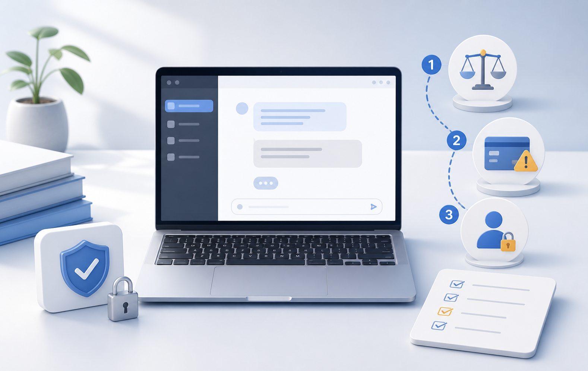
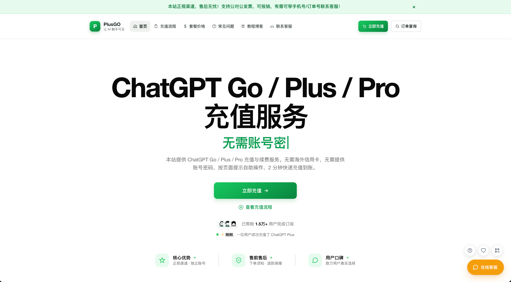
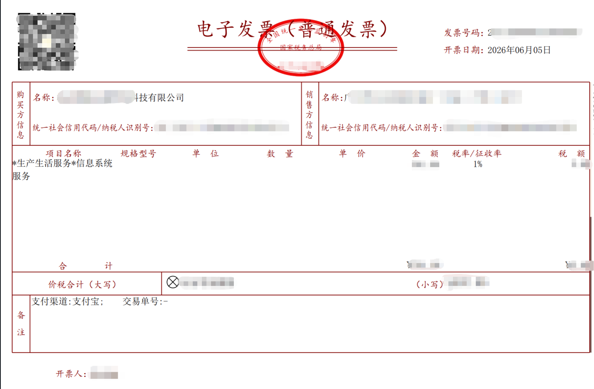
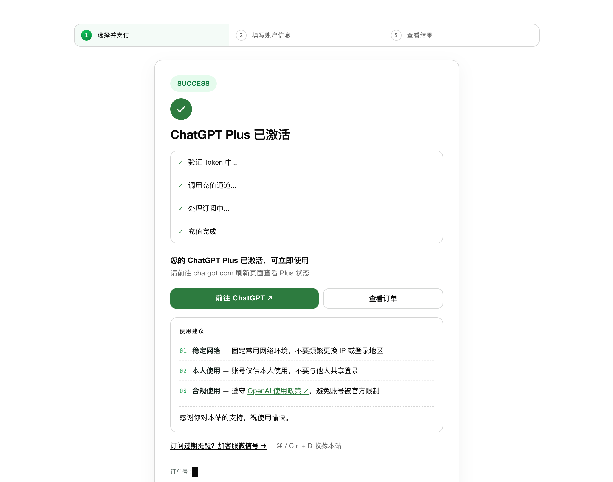

# <p align="center">[亲测可用] 2026 年 ChatGPT 充值 / 代充教程：支付宝、微信开通 GPT-5.6、ChatGPT Plus、Pro、Go、Codex</p>

<p align="center">本教程最新更新时间：2026 年 8 月 10 日 · 官方渠道，自助充值，不用交账号密码，支持开发票可报销</p>

[](https://plusgo.pro/?utm_source=github01)

**建议收藏 + Star 本 ChatGPT 充值教程，方便随时回来查，也防止丢失。**

这两年几种主流路子我全都跑过一遍，踩的坑能写一本书。国内用户真正麻烦的地方，从来不是不会用 ChatGPT，而是卡在 **ChatGPT 充值 / 代充** 这道坎上——银行卡可能被拒、支付页疯狂转圈、验证过不去、第三方平台又不知道哪个靠谱。这篇就一次性把 2026 年还能走通的几种充值方式掰开揉碎讲清楚，让你少踩坑、少走弯路。

如果你只想快速、稳妥地用支付宝或微信开通 ChatGPT Plus / Pro，可以直接跳到 [方法二：第三方自助代充平台（推荐）](#method-topup)，我自己在用的是 <a href="https://plusgo.pro/?utm_source=github01" target="_blank" rel="noopener">PlusGO（plusgo.pro）</a>。

------

## 国内给 ChatGPT 充值，经常会卡在哪些地方？

- **银行卡 / 信用卡可能被拒**：是否能完成付款取决于 OpenAI 当前支持地区、付款页面、发卡机构、卡片状态和账单信息，不能只凭 Visa、Mastercard 或发卡地区下结论。
- **支付页面打不开、一直转圈**：点了 Upgrade to Plus 之后，Stripe 支付窗口加载半天弹不出来。
- **不清楚 ChatGPT 代充和自己充值有什么区别**：很多人搜"GPT 代充"，其实是想找一种更省心、又不用交账号密码的充值方式。
- **充值后能不能稳定续费、会不会封号**：充值不只是付款成功，还包括 Plus / Pro 权益是否正常到账、后续使用是否稳定。

下面四种方式我都跑过，按"省不省心"从高到低排，并给出一张对比表，直接帮你下结论。

------

<a id="gpt-5-6"></a>

## GPT-5.6 已发布（7 月 9 日）：哪个档位才能用上？

GPT-5.6 已经在 2026 年 7 月 9 日正式公开发布。三个型号按能力从弱到强是 **Luna → Terra → Sol**——注意 Luna 是最快最省的那个，不是最强的，名字容易让人搞反。Sol Pro 是面向困难任务和长流程的最高能力选项。

不少人第一反应是"是不是得再买一次"。先看你现在的档位能拿到什么（截至 2026 年 8 月 10 日）：

| 你的档位 | 标准 ChatGPT 对话中的 GPT-5.6 | 说明 |
|---|---|---|
| Free / Go | 默认逐步切换到 Luna；Think 也由 Luna 提供 | 不包含 Sol；OpenAI 宣布从 8 月 10 日当周起逐步开放无限文本聊天，文件、图片等工具仍有限额 |
| **Plus** | Sol 的 Medium、High | 不包含 Extra High 和 Sol Pro |
| Pro 5× / 20× | Sol 的 Medium、High、Extra High，以及 **Sol Pro** | 两档核心能力相同，主要区别是用量 |
| Business | Medium、High、Extra High，以及 **Sol Pro** | 管理员可能控制成员权限 |
| Enterprise | Medium、High、Extra High，以及 **Sol Pro** | 管理员权限和实际开放进度可能影响显示 |

> **模型选择器里看不到 GPT-5.6，不代表账号有问题，也不代表充值没到账。** OpenAI 当前仍将 GPT-5.6 标记为逐步开放；先确认自己所在的是 Chat、ChatGPT Work 还是 Codex，并核对账号档位、工作区权限和页面提示。

官方依据：[GPT-5.6 in ChatGPT](https://help.openai.com/en/articles/20001354-gpt-56-in-chatgpt) · [ChatGPT Release Notes](https://help.openai.com/en/articles/6825453-chatgpt-release-notes) · [ChatGPT Work / Codex 定价与用量](https://learn.chatgpt.com/docs/pricing)

所以结论很简单：**已经是 Plus 的不用额外付费**，Chat 里可以使用 Sol 的 Medium、High；Free 和 Go 获得的是 Luna 与 Luna 驱动的 Think，不包含 Sol。这块展开讲在 [GPT-5.6 要额外付费吗？Plus 和 Pro 各能用到哪个型号](./articles/gpt-5-6-which-plan.md)。

想看型号区别、`max` / `ultra` 模式和 API 价格的完整拆解，可以读 <a href="https://plusgo.pro/blog/gpt-5-6-release-guide/?utm_source=github01&utm_campaign=gpt56" target="_blank" rel="noopener">GPT-5.6 发布了吗？Sol / Terra / Luna 区别</a>；入口仍找不到时，见 <a href="https://plusgo.pro/blog/gpt-5-6-sol-launch/?utm_source=github01&utm_campaign=gpt56" target="_blank" rel="noopener">Sol 正式上线，看不到入口怎么办</a>。

国内没有海外信用卡、想直接把账号开到 Plus / Pro 的，走 [方法二：第三方自助代充平台](#method-topup) 最省心。

------

## 📚 目录

- [GPT-5.6 已发布：哪个档位才能用上](#gpt-5-6)
- [先说结论（一句话）](#summary)
- [方法一：海外信用卡 / 虚拟卡](#method-card)
- [方法二：第三方自助代充平台（推荐）✅](#method-topup)
- [方法三：苹果 App Store 内购](#method-ios)
- [方法四：共享账号 ⚠️](#method-shared)
- [ChatGPT 充值能开发票吗？支持公对公、可报销](#invoice)
- [几种 ChatGPT 充值方式对比](#compare)
- [我的大实话（一句话推荐）](#recommend)
- [第三方平台自检清单](#checklist)
- [2026 年 ChatGPT 充值常见问题 FAQ](#faq)
- [附录：国内自己充 ChatGPT 最常见的 10 个报错](#troubleshooting)
- [Plus 用满后要不要看 Pro](#pro)
- [团队 / 多人一起用：ChatGPT Business](#business)
- [维护说明 / 更新记录](#changelog)

> 更多资料：[GPT-5.6 要额外付费吗（Plus / Pro 各能用哪个型号）](./articles/gpt-5-6-which-plan.md) · [ChatGPT 充值能开发票吗（可报销 / 公对公）](./articles/chatgpt-plus-invoice-reimbursement.md) · [ChatGPT Pro 公司报销怎么入账](./articles/chatgpt-pro-company-reimbursement.md) · [没有国外信用卡怎么开通 ChatGPT Plus](./articles/chatgpt-plus-without-overseas-card.md) · [订阅页面支付异常排查](./articles/chatgpt-plus-payment-troubleshooting.md) · [排障清单](./troubleshooting/) · [常见问题](./faq/)

------

<a id="summary"></a>

## 先说结论（一句话）

- **有稳定海外支付环境、爱折腾**：可以自己用海外信用卡 / 虚拟卡充，但门槛和失败成本都高。
- **想省心、几分钟用支付宝 / 微信搞定**：选靠谱的第三方自助代充平台，**首选不用交账号密码的**，我在用 PlusGO。
- **只用 iPhone**：苹果内购也能走，但要接受切区和苹果风控。
- **只想短期低价体验、完全不在意隐私**：共享账号能用，但隐私和稳定性都很差，不建议长期用。

------

<a id="method-card"></a>

## 方法一：海外信用卡 / 虚拟卡（适合爱折腾、有海外支付经验的人）

- **适合谁：** 技术上不怵、愿意自己排查网络和账单问题、未来还想订阅 Claude / Netflix / Spotify 等海外服务的人。
- **核心思路：** 在 OpenAI 当前支持的国家或地区，使用支持线上订阅的付款方式，并按发卡机构记录如实填写账单信息。

付款前应核对 [ChatGPT 支持国家和地区](https://help.openai.com/en/articles/7947663-chatgpt-supported-countries) 与 [多币种及付款方式说明](https://help.openai.com/en/articles/10421635-multi-currency-billing)。

🚨 **2026 年的现实警告：** 2025 年下半年起，国内主流的几家海外虚拟卡平台因跨境支付合规审查陆续退出运营，过去那套"国内充值 + 一键开卡 + 美区 IP"的傻瓜玩法基本宣告终结。现在还在硬撑的几家，门槛全都拉满了：

- 开卡费 + 月费 + 充值手续费叠加，一年多花不少；
- 大多要过 KYC（身份证 + 人脸），且常常只支持 USDT 充值；
- 平台跑路风险是悬在头上的剑——这两年已经不止一家头部虚拟卡平台先后退场，老用户的余额基本血本无归。

**实操步骤大概是这样：**

1. 找一家目前还在运营的海外虚拟卡平台，完成 KYC 实名
2. 用 USDT（或其他平台支持的方式）充值美元(USDT如何获取也是难上加难，尤其现在C2C风控极期严格，基本上不可能过的)
3. 确认自己所在地区符合 OpenAI 当前支持范围，并保持正常、稳定的网络连接
4. 打开 ChatGPT 官网，点 Upgrade to Plus，按发卡机构记录填写卡号、有效期、CVV 和账单地址，提交

**优点：**

- 最"官方直接"，相当于你自己就是个海外用户，账号完全自主；
- 一卡多用，能覆盖其他需要海外信用卡的服务。

**缺点 / 注意：**

- 地区、付款方式、发卡机构和账单信息都可能影响是否能完成订阅；
- 各种费用叠起来比官方 20 美金贵；
- 一旦失败，很难马上判断是地区、卡片、账单地址还是账号状态的问题，应该保留原始提示并联系对应支持方，不要连续重复提交。

**我的大实话：** 这条路只适合本来就爱折腾海外支付的老手。普通人只为开个 ChatGPT Plus 从零搭这一整套，又费钱又费时间，真心不划算。

------

<a id="method-topup"></a>

## 方法二：第三方自助代充平台（目前最省心的方案，2026 年 7 月实测仍可用）✅

- **适合谁：** 怕折腾、不想搞虚拟卡、网络环境一般、想用支付宝 / 微信几分钟搞定的人。
- **核心思路：** 你用人民币（支付宝 / 微信）在国内代充平台下单，平台按商品页面说明完成 Plus / Pro 订阅交付。Plus 是开到**你自己的 ChatGPT 账号**上，全程**不用把账号密码交出去**。

⚠️ **选平台先认准三条，少一条都别碰：** 支付通道正规（支付宝 / 微信可追溯）+ 自助充值（不用交账号密码）+ 明确售后承诺（充值失败可退款）。别贪小红书、闲鱼那种极低价的盗刷黑充——十有八九这个月开、下个月就关店，真出了问题你连个人都找不到。一个长期稳定、有真实售后的平台，比省那几块钱重要得多。

我自己跑过好几家，最稳、最省心、价格也最厚道的就是 <a href="https://plusgo.pro/?utm_source=github01" target="_blank" rel="noopener">PlusGO（plusgo.pro）</a>，一句话——**该有的都有，售后靠谱**：支持 ChatGPT Go / Plus / Pro / Business（团队版）/ Codex 充值，支付宝 / 微信付人民币，自助充值不用交密码。Go / Plus 通常 1–5 分钟到账；Pro 5× 高峰时可能更久，Pro 20× 以订单进度为准；充值失败当天原路退款，并提供 30 天掉订阅保障。


<a id="invoice"></a>

**ChatGPT 充值能开发票吗？支持公对公、可报销，程序员终于可以不用贴钱上班了！** 🧾

这点真的解决了我一个大痛点：**PlusGO 能开发票（增值税电子普票），支持公对公付款，可以拿去公司报销。**

ChatGPT Pro 现在有 **$100 / 月的 5× 档**和 **$200 / 月的 20× 档**，公司本来能报销，但官方只给一张美元境外 invoice，国内财务根本不认；其它大多数代充平台也只甩个电子 invoice，结果只能自己扛，吃不消。能开**正规增值税发票**就成了我留在这家的关键原因。

- **发票类型：** 增值税电子普通发票（电子普票），可作公司报销凭证。
- **支持公对公：** 可走对公付款，方便走公司账、报销入账。
- **抬头 / 税号：** 下单后带手机号或订单号联系客服，提供发票抬头和纳税人识别号即可开。
- **适合谁：** Pro / Plus 走公司报销的程序员、团队、需要凭证入账的用户。



> 想看发票怎么开、普票能不能报销、抬头怎么填，详见专文：[ChatGPT Plus / Pro 充值能开发票吗？国内如何拿到可报销的增值税发票](./articles/chatgpt-plus-invoice-reimbursement.md)。

**为什么这两年代充最流行：** 操作简单（基本就是支付宝付一下钱）、可以查询订单进度、安卓 / iOS / 网页 / Mac 全平台通用。订阅交付和账号管理是两件事：OpenAI 是否限制账号由其规则和实际使用决定，任何第三方都不能承诺账号不会被限制。

### 整个充值流程（支付宝 / 微信，几分钟搞定）

1. 先确认自己的 ChatGPT 账号能正常登录。
2. 打开 <a href="https://plusgo.pro/?utm_source=github01" target="_blank" rel="noopener">PlusGO</a>，选 Plus 或其他适合自己的套餐。
3. 用支付宝或微信付款。
4. 按提示提交一次性临时会话凭证（access_token，几小时后自动过期），平台自助识别你的账号——**整个过程不需要你的 ChatGPT 密码或邮箱验证码**。
5. 等待开通结果，刷新 ChatGPT 页面确认 Plus 状态；保存订单号，长时间没变化时凭订单号联系售后。

   

### 代充这条路的优缺点

**优点：**

- **真方便**——支付宝 / 微信直接付人民币，不用折腾虚拟卡或代理 IP；
- **进度可查**——Go / Plus 通常 1–5 分钟，Pro 套餐按页面和订单进度查看；
- **售后清晰**——优先选择订单可查、失败退款条件和客服入口写清楚的平台；
- **全平台通用**——升级后安卓 / iOS / 网页 / 桌面端都能用。

**缺点 / 注意：**

- **依赖第三方**——所以一定要选运营稳定、有真实售后承诺的平台，别图便宜碰小作坊；
- **价格随汇率有微调**——但相比官方 20 美金 + 海外信用卡门槛，整体性价比已经很高；
- **🚨 隐私红线**：靠谱的自助平台**绝不需要你提供 ChatGPT 账号密码**。一切让你交完整账号密码的小代充、个人代充，**绝对别用！**

------

<a id="method-ios"></a>

## 方法三：苹果 App Store 内购（仅限苹果用户，2026 年 7 月仍可走通但风控趋严）

- **适合谁：** 有 iPhone / iPad、且 Apple ID 环境比较稳定的人。
- **核心思路：** 把 Apple ID 切到美区，给余额充值后，在 iOS 版 ChatGPT App 内通过苹果内购订阅 Plus。

**步骤大概是：**

1. **切换 Apple ID 到美区**（一次性操作，但有点折腾）：需要美国地址、邮编、电话；**切换前会清空现有订阅和余额，务必想清楚。**
2. **给美区 Apple ID 充值余额**（支付宝有出境充值入口）。
3. **在 iOS 版 ChatGPT App 内订阅**：登录账号 → 升级 Plus → 付款方式选 "Apple ID Balance"。

**优点：**

- 走苹果官方内购，流程在苹果生态内闭环，对 iPhone 用户比较熟悉；
- 订阅管理集中在 Apple ID 里，后续取消、查账单比较清楚。

**缺点 / 注意：**

- **只有 iPhone / iPad 能玩**——安卓、网页、Mac 用户绕道；
- 切区操作有风险，可能影响你原有的订阅和服务；
- 这两年苹果风控收紧，操作不当容易触发账号异常；
- 续费和取消都要在苹果的订阅设置里操作。

**我的看法：** 本来就有稳定 iOS 订阅环境可以考虑；否则不建议为了一个 ChatGPT Plus 去折腾整套美区 Apple ID。

------

<a id="method-shared"></a>

## 方法四：共享账号（预算极紧 + 完全不在意隐私的最后选择）⚠️

- **适合谁：** 只是临时体验一下 Plus、预算极低、且完全不在意聊天内容被别人看到的人。
- **核心思路：** 买一个商家提供的共享 ChatGPT Plus 账号，多人共用一个号。

**优点：** 便宜，几十块就能"体验"。

**缺点 / 注意（请逐条认真看）：**

- 🚨 **零隐私**——你和陌生人共用一个号，**你聊的所有内容对方都看得到，对方聊的你也看得到**。聊工作、聊私事、贴文档贴代码 = 当众裸奔；
- **使用受限**——商家通常限"3 小时 50 条"之类的额度，体验很差；
- **极不稳定**——多人异地登录是封号触发器，账号随时挂掉；
- **基本没有售后**——卖家改密码、店铺一夜消失都常见。

**我的态度：强烈不推荐。** 真想看看 Plus 长啥样，多花几十块用 PlusGO 开个自己的月卡，账号在自己手里、聊啥没人看，它不香吗？

------

<a id="compare"></a>

## 几种 ChatGPT 充值方式对比

| 充值方式 | 操作难度 | 到账速度 | 隐私安全 | 稳定性 | 适合人群 | 综合推荐 |
| --- | --- | --- | --- | --- | --- | --- |
| 海外信用卡 / 虚拟卡 | 高：KYC、充值、开卡并核对支持地区和账单信息 | 不稳定，失败后需要排查 | 中：账号自主，但要把身份信息交给发卡平台 | 中：付款方式、发卡机构和账单信息都可能影响结果 | 有海外支付经验、愿意长期折腾的人 | 不太适合普通用户 |
| 第三方自助代充平台 | 低：支付宝 / 微信付款，按提示自助完成 | 按套餐不同：Go / Plus 通常 1–5 分钟，Pro 看订单进度 | 高：正规自助平台不要账号密码 | 高：平台负责订单交付和售后 | 想省心、省时间、要售后的国内用户 | **最推荐，首选靠谱代充平台** |
| 苹果 App Store 内购 | 中高：切美区、充余额、再订阅 | 中：顺利时较快，余额 / 切区异常会卡 | 中：走苹果内购，但切区有风险 | 中：切区、风控、余额问题都可能影响订阅 | 只用 iPhone / iPad 且熟悉苹果账号的人 | 可选，但不省心 |
| 共享账号 | 低：买来就能登 | 快，但随时可能不可用 | 低：聊天记录、文件都可能暴露 | 低：多人异地登录，封号 / 改密风险高 | 只想短期试用、不在意隐私的人 | **不推荐** |

一句话总结：**普通国内用户想稳定开通 ChatGPT Plus / Pro，最省心的还是选靠谱的自助代充平台。** 尤其是像 <a href="https://plusgo.pro/?utm_source=github01" target="_blank" rel="noopener">PlusGO</a> 这种支持支付宝 / 微信、自助充值、不要账号密码、充值失败可退款的平台，比自己硬折腾虚拟卡现实得多。

------

<a id="recommend"></a>

## 我的大实话（一句话推荐）

- **爱自己折腾、未来还要订其他海外服务？** 海外虚拟卡还能走，但做好高门槛 + KYC + 美区 IP 的心理准备。
- **只用 iPhone 且能接受切区？** 苹果内购还能跑，但 2026 年风控比前两年严，做好折腾的准备。
- **想省心省力、又快又稳、预算正常？** 可以比较支持本地付款和订单售后的代充平台；我使用的是 <a href="https://plusgo.pro/?utm_source=github01" target="_blank" rel="noopener">PlusGO</a>——支付宝 / 微信直接付，自助充值不交密码，适合不想自行排查银行卡付款的用户。
- **预算极紧 + 不在意隐私？** 共享账号能用，但代价大，慎选。

**最后提醒：** 不管选哪种，一个稳定、干净、能访问 ChatGPT 官网的网络环境都是前提，没这个一切白搭。

------

<a id="checklist"></a>

## 第三方平台自检清单

如果你最后走第三方自助代充，下单前至少过一遍这个清单：

```
[ ] 页面说明里没有要求提交 ChatGPT 账号密码
[ ] 能看清楚套餐周期、价格、到账说明和失败处理方式
[ ] 支付后有订单号或可查询的订单状态
[ ] 售后入口明确，不是只能靠临时私聊
[ ] 没有承诺夸张效果，也没有诱导你做高风险操作
[ ] 自己的 ChatGPT 账号可以正常登录和使用
```

我会把"**不交密码**"放在第一位。便宜一点不值得拿主账号去赌，尤其账号里有长期对话、工作资料或自己调好的 GPTs 时。PlusGO 用的是一次性临时会话凭证、不要密码，这一关从源头就堵住了。

------

<a id="faq"></a>

## 2026 年 ChatGPT 充值常见问题 FAQ

### Q1：ChatGPT 充值 / 代充适合技术小白吗？

非常适合。国内主流虚拟卡平台陆续退出后，对小白来说自助代充基本是最可行的路。像 PlusGO 这种自助平台，付款 → 选套餐 → 自助识别账号升级，几分钟就完事，全程不用懂技术，也不用把账号密码交给任何人。

### Q2：淘宝 / 闲鱼上的个人代充能买吗？

**强烈不建议。** 无法核验付款来源和交付方式的个人卖家，可能带来支付争议、订单失联或账号限制风险，而且往往缺少可追溯的售后。便宜是真便宜，代价也可能很大——别拿主账号去赌。

### Q3：通过代充平台开 Plus 会封号吗？

任何第三方都不能保证账号不会被限制。OpenAI 会根据服务条款、账号活动和安全机制独立处理限制或停用；订阅交付成功也不等于获得账号豁免。选择平台时应看订单是否可查、退款与售后边界是否写清楚，并继续遵守 OpenAI 的账号和地区规则。

### Q4：怎么挑靠谱的代充平台？

几个硬指标交叉对比，能筛掉不少信息不透明的平台：

1. **看运营年限和真实口碑**——成立时间长、社区评价 OK 的优先；
2. **看支付方式**——支持支付宝 / 微信的可追溯渠道，只收 USDT 的格外小心；
3. **看是否自助**——优先不用交账号密码的自助平台；
4. **看售后条款**——白纸黑字的"充值失败全额退款"才算专业。

### Q5：第三方代充会不会要我的账号密码？

把"是否要求账号密码"当成筛选红线。正常自助流程不应该让你交出 ChatGPT 密码或邮箱验证码。PlusGO 用的是一次性临时会话凭证（access_token，几小时后自动过期），不是密码；万一遇到要完整账号密码的，直接放弃。

### Q6：充值成功后没看到 Plus 怎么办？

先做三件事：①完全退出账号重新登录，或换无痕模式；②确认你充的是哪个邮箱（很多人多账号，付错了号）；③进 Settings → Plan 看订阅状态。1 小时内还没有，就拿订单号联系平台售后，别反复重新下单。

### Q7：到期了怎么续费？会自动扣款吗？

大多数代充是"单月买断制"，到期不会自动扣款。PlusGO 也可能提供 3 个月、12 个月等第三方服务组合，但这不代表 OpenAI 提供官方年付或一次预付多个月；下单前要看清按月交付、续费和退款规则。

### Q8：充值成功后能退款吗？

分情况：**充值失败 → 原路全额退款**；**已成功开通且账号正常使用 → 一般不支持七天无理由退款**（Plus 属于虚拟数字商品，已交付即视为消费完成）。下单前先看清平台的退款条款。

### Q9：ChatGPT 充值能开发票吗？能报销吗？

能。官方订阅只给美元境外 invoice，国内公司财务通常不认、报不了销；但走支持开票的代充平台，可以拿到**增值税电子普通发票**，作为公司报销凭证。我在用的 PlusGO 就支持开发票、可走公对公付款——下单后带手机号或订单号联系客服，提供抬头和纳税人识别号即可。Pro 5×（$100 / 月）和 Pro 20×（$200 / 月）走公司报销，尤其用得上。详见 [ChatGPT 充值能开发票吗？怎么报销](./articles/chatgpt-plus-invoice-reimbursement.md)。

### Q10：团队里好几个人都要用，是每人开一个 Plus 还是上 Business？

看人数，也看要不要统一管理和报销。OpenAI 官方的 Business 标准 ChatGPT 席位**最低 2 席**，参考价为月付 **$25 / 席 / 月**、年付折算 **$20 / 席 / 月**；PlusGO 当前的 Business 购买渠道则是 **5 席起、最多 50 席**。自 2026 年 8 月 19 日起，OpenAI 自助 Business 新增付费席位会立即按当前账期剩余时间比例扣款；这项官方计费规则不等同于 PlusGO 的渠道规则。展开见上面 [团队 / 多人一起用：要不要上 ChatGPT Business](#business)。

------

<a id="troubleshooting"></a>

## 附录：国内自己充 ChatGPT 最常见的 10 个报错排查

下面这些坑是我自己和身边一堆朋友实打实踩过的。如果你正打算自己付款，先对照这一节排查；连续失败时保存原始提示，不要无谓地重复提交。

### 1. "Your credit card was declined" / 信用卡被拒（最高频）

不能只凭 Visa / Mastercard 标识或发卡地区判断原因。OpenAI 网页结账支持信用卡、借记卡和多种币种，但服务与付款仍受支持国家和地区政策、发卡机构、卡片状态、账单信息及支付服务方结果影响。先确认是否实际扣款，再按页面提示联系发卡机构或 OpenAI 支持。

### 2. "Country not supported" / 您所在的地区暂不支持

以 OpenAI 当前支持国家和地区列表为准。从不支持地区访问或提供访问可能导致账号受限，第三方付款也不能改变地区可用性；不要通过代理、虚假账单地址或频繁切换地区绕过限制。

### 3. 升级按钮点了没反应 / Stripe 支付页无限转圈

常见原因包括网络不稳定、浏览器缓存或扩展阻止支付组件、Cookie 或脚本未正常加载。确认域名和证书正常后，可用无痕窗口、关闭拦截扩展或换浏览器验证；仍失败时保存错误信息并停止重复提交。

### 4. "Something went wrong, please try again later" / 充值时出错

这是一条通用错误，单凭提示无法判断是页面、服务状态、账号还是支付链路问题。记录发生时间和完整提示，检查 OpenAI 服务状态；持续出现时通过官方支持处理，不要自行推断固定的 BIN、IP 或账号标签机制。

### 5. 虚拟卡平台官网突然打不开 / DNS 解析失败

前两年常用的几家海外虚拟卡平台已在 2025 下半年因合规审查陆续退出，对应域名已无法访问。网上"某某卡复活""续命包"之类的消息基本是钓鱼，别再往里扔钱。

### 6. 海外支付的二次验证（3D Secure）过不去

3D Secure 是 Visa / Mastercard 的二次验证，需要银行下发短信验证码。国内信用卡基本没接入海外 3D Secure 体系，收不到验证码，自然过不了——这是国内卡在 OpenAI 充值几乎必然失败的另一个底层原因。

### 7. 切区后美区 Apple ID 无法登录 / 提示未激活

切区后 Apple ID 没完成"美区激活"。Apple 要求新切区账号在 App Store 有过一次真实活动（下载免费 App 或充值激活）才算正式激活。先做一次小额激活，再去订阅。

### 8. 充值成功了，但账号没有 Plus 标识

先做三件事：①完全退出重新登录，或换无痕；②确认你充的是哪个邮箱；③进 Settings → Plan 看订阅状态。1 小时内还没有，去邮箱搜 "Receipt from OpenAI" 确认有没有扣款成功。

### 9. "Your account has been deactivated" / 账号已封禁

账号被停用可能涉及服务条款、可疑活动或安全机制，但不能只凭发生在充值前后就推断具体原因。按 OpenAI 页面提示通过官方支持渠道申诉，提交真实、可核对的信息；PlusGO 只能处理本平台订单和售后，不能代替 OpenAI 解封账号。

### 10. App 端和网页端 Plus 状态不一致

有时网页端已显示 Plus，App 端还没刷新；也可能 App 登录了另一个邮箱。先退出 App 重新登录，再确认邮箱。仍不同步就等一会儿，不要马上重复购买。

### 一句话总结

自己付款时，先核对支持地区、发卡机构、卡片状态、账单信息和页面原始提示；连续失败不要重复提交。若改用第三方服务，也要确认域名、凭证安全、订单查询和退款边界，并继续遵守 OpenAI 的地区与账号规则。

------

<a id="pro"></a>

## Plus 用满后要不要看 Pro 5× / 20×

先把 Plus 当起点，而不是把 Pro 当默认。Plus 适合大多数日常写作、翻译、问答、轻度代码和资料整理；Pro 更适合每天长时间用 ChatGPT 或 Codex、经常被额度或任务长度打断的重度用户。官方现在提供 **Pro $100 / 月（5× 用量）**和 **Pro $200 / 月（20× 用量）**两档，两档核心能力相同，主要区别是使用额度。

```
[ ] Plus 额度经常在工作中途用完
[ ] 每天连续用 ChatGPT 或 Codex 处理项目
[ ] 经常做长文档分析、复杂代码修改或深度研究
[ ] 订阅成本能被省下来的时间覆盖
```

如果只是偶尔问答、写文案、轻度编程，Plus 通常够用。经常吃满 Plus 额度时先看 Pro 5×；持续并行跑重任务、5× 仍不够时再看 Pro 20×。确认自己是重度用户后，可以继续看这份 Pro 教程：[ChatGPT Pro 充值代充指南：国内如何用微信 / 支付宝订阅 Pro 会员](https://github.com/duck-gogo/chatgpt-pro-tutorial)。

> 💡 Pro 5× 为 $100 / 月，Pro 20× 为 $200 / 月。如果走公司报销，记得选**能开发票**的充值方式——官方境外 invoice 国内财务多半不认。怎么拿到可报销的增值税发票，见 [ChatGPT 充值能开发票吗？怎么报销](./articles/chatgpt-plus-invoice-reimbursement.md)。

------

<a id="business"></a>

## 团队 / 多人一起用：要不要上 ChatGPT Business

前面 Plus、Pro 都是给一个人用的。如果是一个小团队、工作室，或者公司里好几个人都要用 ChatGPT，一人开一个 Plus 就有点乱——账号分散、报销也各交各的。这种多人场景，可以看 OpenAI 的团队档 **ChatGPT Business**（早期叫 ChatGPT Team）。

**它和 Plus 差在哪：**

- **按席位买、多人协作**：一个工作区里拉进多个成员，管理员统一加人 / 减人，不用每个人各自守一个号；
- **官方按人头计价**：标准 ChatGPT 席位最低 2 席；参考价为月付 **$25 / 席 / 月**、年付折算 **$20 / 席 / 月**；
- **新增席位计费时间**：自 2026 年 8 月 19 日起，OpenAI 自助 Business 新增付费席位会立即按当前账期剩余时间比例扣款；
- **数据默认不用于模型训练**：团队和公司场景通常更在意这一点；
- **报销更清爽**：多个席位可以走一张发票、对公付款，比一人一单好入账。

官方依据：[What is ChatGPT Business?](https://help.openai.com/en/articles/8792828-what-is-chatgpt-business)

**适合谁 / 不适合谁：**

- **适合**：团队 / 工作室 / 公司里有好几个人要长期用，需要统一管理席位、集中报销、走对公付款的；
- **不适合**：只有你自己一个人用——那 Plus 就够了，没必要为了"团队版"三个字多花钱。

**国内怎么开（和 Plus 一样走支付宝 / 微信）：**

OpenAI 官方标准 ChatGPT 席位最低 2 席；下面是 PlusGO 当前购买渠道的规则和流程：

1. 先想清楚要开几个席位——PlusGO 当前渠道为 **5 席起、最多 50 席**，按你选的席位数计费；
2. 在代充平台选 ChatGPT Business，填席位数，页面会实时把总额算出来；
3. 支付宝 / 微信扫码付款；需要对公付款、开发票的，下单后带订单号联系客服说明抬头和税号；
4. 开通方案由**专人对接确认**，付完保存订单号，有问题凭订单号找售后。

我自己用的 <a href="https://plusgo.pro/?utm_source=github01" target="_blank" rel="noopener">PlusGO</a> 这块也能走：Business 按席位下单、支付宝 / 微信付人民币、可对公开发票、充值失败原路退款，适合卡在"团队多人 + 报销"这一环的人。再说一句，个人单用真的不用考虑它，Plus 就够。

> 💡 团队采购基本都要报销：多个席位建议一次性开、走对公付款 + 一张发票，入账最省事。发票怎么开、普票能不能报销，见 [ChatGPT 充值能开发票吗？怎么报销](./articles/chatgpt-plus-invoice-reimbursement.md)。

------

<a id="changelog"></a>

## 维护说明 / 更新记录

这份教程会优先更新：ChatGPT 充值入口或页面提示变化、国内常见支付失败 / 账号状态 / 续费问题的新表现、第三方代充平台筛选标准、Plus / Pro / Go / Codex 档位的新选择问题、新模型发布后各档位的可用性变化。

- 2026-08-02：修正 Pro 两档（$100 / 5×、$200 / 20×）、Business 官方最低 2 个标准席位与 PlusGO 当前 5–50 席渠道口径，并更新 GPT-5.6 的 Business / Enterprise 权益和发布后排查提示。
- 2026-07-20：新增 [ChatGPT Business（团队版）](#business) 区块——面向多人团队 / 公司统一采购与报销，说明 PlusGO 渠道按席位（5 席起、最多 50 席）开通、支付宝 / 微信付款、可对公开发票；方法二档位列表与 FAQ 同步补入 Business。
- 2026-07-10：GPT-5.6（Luna / Terra / Sol）于 7 月 9 日正式发布，新增 [档位对照区块](#gpt-5-6) 说明哪个档位能用上哪个型号，并补充专文《GPT-5.6 要额外付费吗》；标题补入 GPT-5.6。
- 2026-07-04：例行时效巡检——确认第三方自助代充、苹果内购在 7 月仍可走通，bump 更新时间并在仍有效方法旁标注「2026 年 7 月实测仍可用」。
- 2026-06-28：新增「能开发票 / 可报销」内容簇——专文《ChatGPT 充值能开发票吗》、README 发票小节（`#invoice`）与 FAQ，主打公对公报销人群。
- 2026-06-27：围绕"ChatGPT 充值 / 代充"重写 README，统一第一人称实测口吻，补充真实充值流程截图、6 列方式对比表、PlusGO 售后条款，细化 10 个报错排查。
- 2026-06-22：新增公开文章《没有国外信用卡怎么开通 ChatGPT Plus》，补全 `troubleshooting/` 与 `faq/` 单页。
- 2026-06-07：补充 Plus 用满后的 Pro 判断标准，并关联 ChatGPT Pro 教程仓库。
- 2026-05-23：补充完整教程框架、几种开通方式、FAQ 和 10 个常见排错项。

------

## 免责声明

本项目内容仅供信息参考，请遵守相关法律法规及各平台使用条款，所有操作与后果由用户自行承担。不同平台政策和风控状态会变化，请以实际页面提示为准，并自行判断风险。
